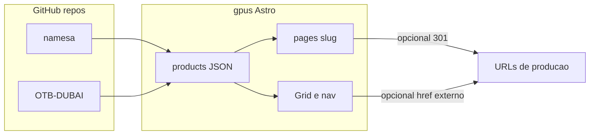

## Enhancement Summary

**Deepened on:** 2026-03-25  
**Base plan:** `.cursor/plans/namesa_otb_redirect_sync_f4600afc.plan.md`  
**Sections enhanced:** 6 (+ estado atual pós-implementação)  
**Research sources:** Astro static redirect behavior, SEO tradeoffs (meta refresh vs HTTP 301), estado do repo `gpus` após merge.

### Key Improvements (vs plano original)

1. **Esclarecimento técnico:** em `output: 'static'`, redirects configurados no Astro para URLs externas geram **HTML com meta refresh**, não HTTP 301 — importante para expectativas de SEO e decisão de usar redirect no edge.
2. **Sincronização de documentação:** o plano original citava `na-mesa-certa.astro` / `otb.astro`; o estado atual remove essas páginas em favor de `redirects` + links diretos no grid.
3. **Checklist de drift:** explicitar os três pontos onde a URL deve coincidir (`externalSiteUrl`, `cta.url`, `astro.config redirects`) e opção de CI/script.
4. **Próximos passos priorizados:** acesso ao repo namesa; URL definitiva OTB; opcional 301 no host.

### New Considerations Discovered

- Google trata meta refresh de curta duração de forma parecida com redirect, mas **HTTP 301/308 no servidor** continua sendo o ouro para link equity; em hospedagem estática pura, Netlify/Vercel/Cloudflare **redirect rules** são o padrão da indústria quando SEO é crítico.
- Duplicar destino em JSON e config é **aceitável em equipes pequenas** se houver convenção documentada; em escala, gerar `redirects` a partir dos dados ou validar em CI reduz incidentes.
- Links `target="_blank"` exigem **comunicação acessível** (já há `sr-only` no grid; nav/footer podem ganhar indicação equivalente se o time de UX exigir paridade).

---

# Plano: conteúdo namesa + OTB-DUBAI e redirecionamento (original preservado + pesquisa)

## Estado atual (pós-implementação — 2026-03-25)

- Rotas **`/na-mesa-certa`** e **`/otb`**: geradas como HTML de redirect no build (`noindex`, `canonical` para destino externo).
- **Grid + header + footer:** usam `externalSiteUrl` dos JSON; links externos com `target="_blank"` e `rel="noopener noreferrer"`; card com texto `sr-only` para leitores de tela.
- **`@astrojs/sitemap`:** `filter` exclui `/na-mesa-certa` e `/otb` do XML.
- **OTB:** copy enriquecido a partir do repositório público OTB-DUBAI; destino atual do deck: `https://ota-dubai.lovable.app/`.
- **Namesa:** repo não clonável no ambiente da implementação; `na-mesa-certa.json` manteve estrutura + `externalSiteUrl` para `https://namesacerta.com.br/`.

---

## Contexto no repositório atual

*(texto original do plano)*

- Já existem landings Astro em `src/pages/na-mesa-certa.astro` e `src/pages/otb.astro`…

### Research Insights

**Nota de atualização:** essas páginas `.astro` **foram removidas** na implementação; o plano deve ser lido como histórico. O conteúdo de produto permanece nos JSON para uso futuro (cards, JSON-LD, emails) e consistência de schema.

**Best practices:**

- Manter **uma narrativa institucional mínima** na home (grid) mesmo sem landing longa — evita páginas órfãs de contexto.
- Se reintroduzir landing curta no domínio próprio, usar **`rel="canonical"`** apontando para o site externo canônico para evitar conteúdo duplicado.

**References:**

- [Astro redirects (docs)](https://docs.astro.build/en/guides/configuring-astro/#redirects)
- Discussão static vs server redirect: [withastro/docs#8917](https://github.com/withastro/docs/issues/8917)

---

## Decisão de produto (bloqueante antes de codar)

*(tabela A / B / C preservada)*

### Research Insights

**Implementado:** modelo **C (híbrido)** — links diretos no nav/grid + redirects nas rotas `/slug` para bookmarks e links legados.

**Edge cases:**

- Campanhas com URLs antigas `grupous.com.br/otb` continuam funcionando via redirect estático.
- Anúncios que apontem direto ao Lovable **não passam** pelo domínio institucional — considerar UTMs nos links do grid se marketing precisar atribuição.

---

## Fase 1 — Extrair conteúdo dos repositórios

*(passos 1–3 preservados)*

### Research Insights

**Performance / processo:**

- Para diff de copy, preferir **export texto** (Google Docs) ou **build estático** do app e extração de strings, em vez de copiar UI manualmente.
- Automatizar “drift detection” entre repos somente se o ritmo de release dos apps > 1x/mês; caso contrário, checklist manual no release do site institucional basta.

**Pendência real:** acesso ao GitHub **GrupoUS/namesa** (privado) ou CMS export.

---

## Fase 2 — Atualizar dados e links

*(schema `externalSiteUrl`, nav, grid, Card — preservado)*

### Research Insights

**Implementation details:**

- Padrão atual: `ProductNavLink` com `external?: boolean` — extensível para `sponsored` / `utm` sem quebrar consumidores.
- **A11y:** WCAG recomenda informar abertura em nova janela; padrão atual cobre o grid; alinhar footer/header se auditoria pedir paridade literal.

**Anti-pattern:** adicionar `externalSiteUrl` sem atualizar `redirects` — usuários com bookmark em `/slug` iriam para destino antigo se ainda existisse HTML estático com URL desatualizada (hoje os dois devem ser editados juntos).

---

## Fase 3 — Redirecionamento técnico

*(preferência astro.config + fallback edge — preservado)*

### Research Insights

**Best practices (2024–2026):**

- **Static Astro:** `redirects` em `defineConfig` para destinos externos produzem página HTML com `<meta http-equiv="refresh">` e link visível — adequado para compatibilidade máxima em qualquer host estático.
- **SEO “forte”:** configurar **HTTP 301** no **Caddy** (Railway), **Cloudflare Redirect Rules**, **Netlify `_redirects`**, ou **Vercel `vercel.json`**, conforme o stack real de deploy — o plano original já citava esse fallback; vale tratá-lo como **recomendação P1** se OTB/Na Mesa forem páginas de alto valor orgânico.

**Performance:** meta refresh `content="0"` é leve; o custo é SEO, não LCP.

**References:**

- [Astro static redirect limitations](https://docs.astro.build/en/reference/errors/static-redirect-not-available/)
- Artigo prático: [Astro SSG redirects / GitHub Pages](https://puf.io/posts/astro-ssg-redirects/) (padrões semelhantes a hospedagem estática genérica)

---

## Fase 4 — SEO e consistência

*(sitemap + meta — preservado)*

### Research Insights

**Sitemap:**

- Excluir URLs que só redirecionam com `noindex` está alinhado à prática de não inflar o sitemap com páginas sem valor de indexação.
- Garantir que o **destino externo** tenha seu próprio `sitemap.xml` e política de indexação (Lovable / domínio final).

**Structured data:**

- Se no futuro os JSON de produto alimentarem **JSON-LD** na home, usar `url` do produto = **URL canônica do produto** (externa), não `grupous.com.br/slug`, para evitar inconsistência com o redirect.

---

## Fase 5 — Validação

*(astro check, build, fluxos — preservado)*

### Research Insights

**Quality gate sugerido (incremental):**

- Teste manual: abrir `/otb` e `/na-mesa-certa` no `bun run preview` e confirmar destino + `canonical` no HTML.
- Opcional: teste automatizado com Playwright checando status **final** da navegação (200 no destino externo).

---

## Nota sobre o workflow `/design`

*(preservada)*

### Research Insights

Se houver **reconvergência** (mini-landing institucional com resumo + CTA), aí sim reabrir Phase 0A (ui-ux-pro-max) para não violar GPUS tokens e hierarquia visual.

---

## Diagrama (original)

---

## Próximas ações sugeridas (síntese)

| Prioridade | Ação |
|------------|------|
| P0 | Definir URL definitiva do deck OTB; atualizar JSON + `redirects` em um PR único. |
| P0 | Obter acesso ao repo **namesa** e sincronizar `na-mesa-certa.json`. |
| P1 | Se SEO for crítico: HTTP 301 no host para `/otb` e `/na-mesa-certa`. |
| P2 | Script ou CI `check:external-urls` para alinhar JSON e `astro.config`. |
| P2 | UTMs padronizados nos `externalSiteUrl` se marketing exigir atribuição. |

---

## Pós-aprofundamento — opções para você

1. **Ver diff** — comparar este arquivo com o plano em `.cursor/plans/`.
2. **Implementar só P0** — URLs + copy namesa quando houver acesso.
3. **Deepen further** — pesquisa específica só para **Railway + Caddy 301** ou só para **UTM policy**.
4. **Revisão técnica** — passar o checklist SEO com alguém do marketing.
